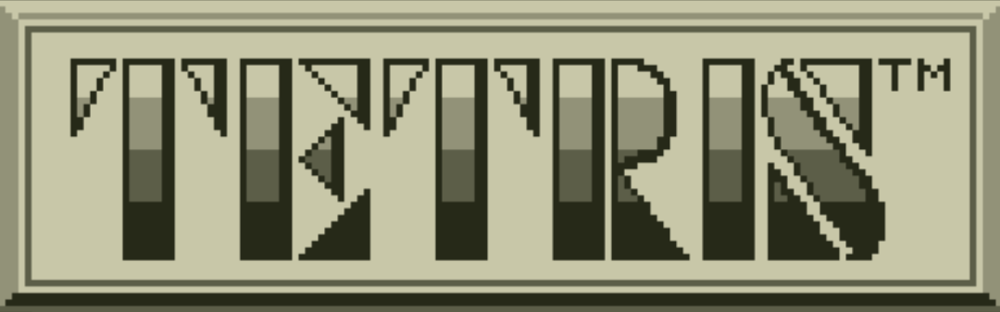

# Tetris — Java (Tema GameBoy)



**Tetris desenvolvido em Java com tema inspirado na versão de GameBoy.**

---

## Descrição

Recriação do clássico Tetris feita em Java, com visual e sensação inspirados no GameBoy. O projeto contém o código-fonte Java, binários e scripts para execução, além de arquivos para salvar pontuação e dados locais.

---

## Recursos

* Mecânica clássica de Tetris (movimentação, rotação, queda rápida, linhas completas).
* Sistema de pontuação / highscore.
* Tema visual inspirado no GameBoy.
* Scripts de execução para Linux/macOS (`run.sh`) e Windows (`run.ps1`).

---

## Tecnologias

* Java (código-fonte principal)
* Shell / PowerShell (scripts de execução)

---

## Requisitos

* JDK 8+ (recomenda-se JDK 11+)
* `bash` (Linux/macOS) ou PowerShell (Windows)

---

## Como executar

1. Clonar o repositório:

```bash
git clone https://github.com/teusbonfim/Tetris_Java_Gameboy.git
cd Tetris_Java_Gameboy
```

2. Executar via script:

* Linux/macOS:

```bash
chmod +x run.sh
./run.sh
```

* Windows (PowerShell):

```powershell
./run.ps1
```

3. Compilação manual:

```bash
# Compila todos os .java dentro de src/
find src -name "*.java" > sources.txt
javac -d bin @sources.txt
```

Depois, execute a classe que contém `main` (ex.: `com.tetris.Game`):

```bash
java -cp bin com.tetris.Game
```

> Dica: procure a classe com `public static void main` para identificar qual rodar.

---

## Controles (padrão)

* **Seta Esquerda/Direita**: mover peça
* **Seta Baixo**: queda lenta
* **Espaço / Seta Cima**: queda instantânea / rotacionar
* **P**: pausar
* **Esc / Q**: sair

> Ajuste conforme a implementação real no código.

---

## Estrutura do projeto

* `src/` — código-fonte Java
* `bin/` — classes compiladas
* `lib/` — bibliotecas externas (se houver)
* `run.sh` — script Linux/macOS
* `run.ps1` — script Windows
* `highscore.txt` — arquivo de recorde
* `tetris.db` — banco de dados local

---

## Contribuição

1. Abra uma *issue* descrevendo a melhoria.
2. Faça um fork e crie uma branch (`feat/nova-funcionalidade`, `fix/bug-x`).
3. Envie um Pull Request com descrição clara das mudanças.

**Dicas:**

* Mantenha o estilo do código consistente.
* Comente alterações que impactam a jogabilidade.
* Inclua screenshots se aplicável.

---

## Sugestões de melhorias

* Adicionar JAR executável.
* Documentar controles exatos.
* Adicionar licença para contribuir legalmente (ex.: MIT).

---

## Licença

Atualmente não há licença definida. Recomenda-se adicionar uma (ex.: MIT) para permitir uso e contribuições.

---

## Contato

Para dúvidas ou sugestões, abra uma *issue* no GitHub.
